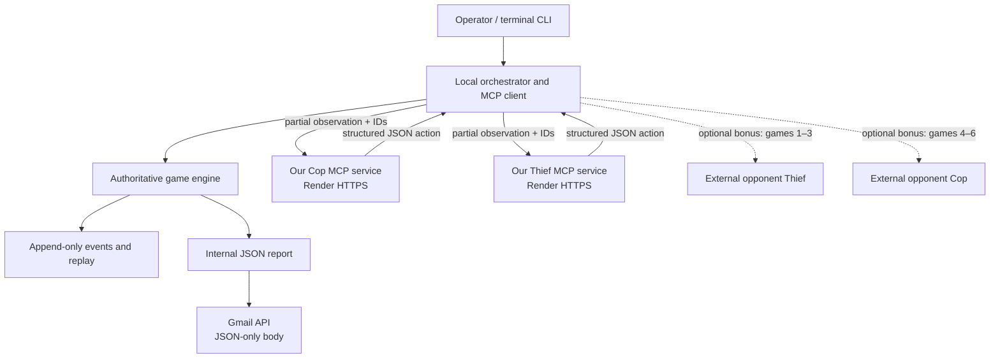

# AI Agent Orchestration: Dual MCP Cop and Thief

Course: AI Agent Orchestration
Group: `salareen`

- Saleh Hammam — 318827417
- Areen Tarabeh — 214028904

Repository: <https://github.com/areen-at/AI-agents-HW6>

## Project goal

This project implements the required six-game Cop-and-Thief assignment as a decentralized,
partially observable multi-agent system. Our Cop and Thief run behind separate authenticated
decision-service URLs. A local orchestrator owns the series workflow, while a deterministic
authoritative engine alone validates actions, changes game state, decides terminal outcomes, and
calculates scores.

The required normal mode is complete:

- default `5 x 5` grid;
- six valid sub-games;
- at most 25 move rounds per game;
- separate Cop and Thief services;
- partial natural-language observations and structured JSON actions;
- authenticated public HTTPS endpoints;
- terminal visualization, structured logs, and offline replay;
- canonical internal JSON report; and
- Gmail API delivery of the JSON-only report.

The Phase 13 clean release rehearsal passed from GitHub commit `8e9e60b`, including formatting,
linting, strict typing, 110 tests, authenticated public execution, report validation, replay, Gmail
preflight, and secret scanning.

Q-learning and inter-group bonus automation are optional later phases. The working baseline uses
deterministic heuristic policies.

## Public MCP endpoints

- Cop: `https://salareen-cop.onrender.com/mcp`
- Thief: `https://salareen-thief.onrender.com/mcp`

Both endpoints require separate Bearer tokens. Tokens are not stored in Git. Render free services
may sleep when idle, so allow time for a cold start and run authenticated health checks before a
timed match.

## Required mode versus optional bonus

### Required internal mode

The repository owns exactly two production decision services:

1. our Cop service; and
2. our Thief service.

Internal mode runs these two agents against each other for exactly six valid games and produces
`reports/internal_game_report.json`.

### Optional inter-group bonus

Bonus mode does not create or impersonate a second production team. It will connect our existing
services to another real class team's externally hosted services:

- games 1–3: our Cop versus the opponent Thief;
- games 4–6: the opponent Cop versus our Thief.

Production bonus mode requires the opponent's real:

- group name;
- student list;
- GitHub repository URL;
- Cop MCP URL;
- Thief MCP URL;
- authentication exchange procedure; and
- confirmation of compatible protocol version.

`bonus-mock` is test-only. Mock results are written only to
`reports/bonus_game_report.mock.json`, are visibly marked `test_only`, never contain bonus claims,
and cannot set `mutual_agreement` to `true`. Phase 15 production orchestration is implemented, but
it remains fail-closed until a real opponent supplies its metadata/endpoints and both groups
confirm the same agreement hash.

## Architecture



### Responsibility boundaries

| Component | Owns | Must not do |
|---|---|---|
| Domain engine | legal actions, immutable transitions, capture, move limit, barriers, scoring | call MCP, Gmail, UI, or deployment providers |
| Orchestrator | series order, requests, retries, technical-attempt replacement, event recording | invent strategic fallback actions or mutate state directly |
| Cop service | Cop policy and Cop decision response | access hidden authoritative state or control scoring |
| Thief service | Thief policy and Thief decision response | access hidden authoritative state or control scoring |
| Terminal UI | read-only committed-state projection | duplicate game rules or become agent input |
| Report layer | report construction from terminal records | calculate outcomes independently |
| Gmail adapter | send an already validated canonical JSON payload | rerun games or alter the report |

The engine is the only state authority because agents are untrusted action proposers. Centralizing
validation prevents hidden-state leakage, divergent rule implementations, invalid scoring, and UI
or network failures from changing strategic results.

## Decision flow and MCP boundary

Each decision follows this sequence:

1. The engine exposes the active role and committed state to the observation builder.
2. The observation builder removes hidden information and creates the role's legal-action list.
3. The orchestrator assigns a request ID and correlation ID.
4. It sends the role server a natural-language instruction plus a JSON observation.
5. The server's policy chooses from that observation and returns exactly one JSON action.
6. The strict parser validates protocol version, role, request ID, schema, and legality.
7. The engine applies the accepted action immutably.
8. The application records before/after state hashes and the committed snapshot.

The prompt tells the agent its role objective, forbids invention of hidden board state, includes the
current public observation, and requires one JSON object with no prose. A typical movement response
is:

```json
{
  "protocol_version": "1.0",
  "request_id": "request-uuid",
  "role": "thief",
  "action": {
    "type": "move",
    "direction": "right"
  }
}
```

The Cop may instead return `place_barrier` with a `[row, column]` target. The transport currently
uses a dependency-light JSON-over-HTTP MCP-style boundary with health, identity, capabilities, and
decision operations under `/mcp`.

## Formal Dec-POMDP model

The game is modeled as:

`<n, S, {A_i}, P, R, {Omega_i}, O, gamma>`

| Element | Project mapping |
|---|---|
| `n` | Two agents: Cop and Thief |
| `S` | Grid dimensions, both positions, barriers, active role, move round, barrier count, seed, IDs, and terminal metadata |
| `{A_i}` | Thief: legal orthogonal moves. Cop: legal orthogonal moves plus legal barrier placements |
| `P` | Deterministic engine transition for a valid action; seeded randomness is used only for reproducible initial placement |
| `R` | Terminal score matrix: capture gives Cop/Thief `20/5`; survival gives `5/10` |
| `{Omega_i}` | Role-specific observations containing self position, visible opponent/barriers, counters, legal actions, and bounded history |
| `O` | Manhattan-radius observation function, default radius `2` |
| `gamma` | Not active in the heuristic baseline; if optional Q-learning is enabled later, `gamma` will be an explicit configurable discount factor |

### State, actions, transitions, and rewards

Coordinates are zero-based `[row, column]`, with `[0,0]` at the top-left. Rows increase downward;
columns increase rightward.

The Thief acts first in every round. If the Thief action is non-terminal, the Cop acts. A Cop
movement onto the exact Thief cell captures immediately. If capture does not occur, the Thief wins
after surviving the configured move limit. Capture takes precedence on the final round.

Only the Cop can place barriers. Placement consumes the Cop action, targets an adjacent orthogonal
empty cell, respects the maximum barrier count, and cannot leave either player with no legal move.

All transitions are deterministic after initialization. Invalid actions never mutate state.
Technical failures are not strategic losses: the attempt is recorded as invalid, receives no
score, and is replaced until six valid games complete or the safety limit is reached.

### Partial observability

Each agent always receives:

- its role and own coordinate;
- grid dimensions;
- move and barrier counters;
- its legal actions;
- barriers within the configured Manhattan radius;
- the opponent coordinate only when within that radius; and
- bounded history summaries when supplied.

Agents do not receive:

- the hidden opponent coordinate outside the radius;
- hidden barriers;
- the full authoritative `GameState`;
- random-generator internals or future seeds;
- the human terminal rendering;
- the other agent's private memory; or
- credentials and tokens.

This makes observations sufficient for legal decentralized decisions without collapsing the task
into a fully observable centralized game.

### Policy status and optional learning

The baseline policies are deterministic heuristics:

- Cop pursues a visible Thief and may place a useful legal barrier.
- Thief chooses movement actions that improve escape safety.

Q-learning is implemented as an optional, disabled-by-default policy and is not required for
baseline compliance. It uses observation-only state encoding, separate versioned Cop and Thief
tables, configurable epsilon-greedy selection, and terminal-safe updates. The heuristic remains the
fallback. Run `python main.py --mode internal --config config.json --evaluate-learning` for a
reproducible baseline comparison.

## Installation

Python 3.10 or newer is required. Python 3.12 is used by the deployment image.

```powershell
git clone https://github.com/areen-at/AI-agents-HW6.git
cd AI-agents-HW6
python -m venv .venv
.\.venv\Scripts\Activate.ps1
python -m pip install --upgrade pip
python -m pip install -e .
```

Install Gmail support:

```powershell
python -m pip install -e ".[gmail]"
```

Install developer tools if desired:

```powershell
python -m pip install -e ".[dev,gmail]"
```

## Configuration

`config.json` is tracked because it contains public, non-secret assignment configuration.

| Group | Fields and meaning |
|---|---|
| `group` | group name, GitHub repository, student names/IDs |
| `my_servers` | our distinct Cop and Thief MCP URLs |
| `bonus_opponent` | external opponent metadata and URLs; placeholders are accepted only in mock mode |
| `game` | grid size, move limit, six-game count, barrier limit, score matrix |
| `observation` | Manhattan visibility radius |
| `runtime` | timezone, seed, timeout, retries, technical attempt limit |
| `reports` | internal, bonus, and mock report paths |
| `logging` | log level and event-log directory |

Default game values are:

```json
{
  "grid_size": [5, 5],
  "max_moves": 25,
  "num_games": 6,
  "max_barriers": 5,
  "scoring": {
    "cop_win": 20,
    "thief_win": 10,
    "cop_loss": 5,
    "thief_loss": 5
  }
}
```

### Private environment

Copy `.env.example` to `.env` and fill values locally:

```powershell
Copy-Item .env.example .env
```

Required for authenticated deployed services:

```text
COP_MCP_TOKEN=
THIEF_MCP_TOKEN=
```

Optional/future bonus tokens:

```text
OPPONENT_COP_MCP_TOKEN=
OPPONENT_THIEF_MCP_TOKEN=
```

Gmail paths:

```text
GOOGLE_CREDENTIALS_FILE=credentials.json
GOOGLE_TOKEN_FILE=token.json
GMAIL_DELIVERY_RECEIPT_FILE=artifacts/reports/gmail_delivery_receipt.json
```

`.env`, OAuth files, reports, receipts, logs, and assignment PDFs are ignored. Never place secrets
in `config.json`, command arguments, documentation, reports, screenshots, or commits.

PowerShell does not automatically load `.env`. For a current shell:

```powershell
Get-Content .env | ForEach-Object {
    if ($_ -match '^([^#=]+)=(.*)$') {
        [Environment]::SetEnvironmentVariable($matches[1], $matches[2], 'Process')
    }
}
```

## Running locally

### Start authenticated role servers

Open two terminals after loading `.env`.

Cop:

```powershell
$env:PYTHONPATH='src'
python -m ai_agents_hw6.mcp_servers.http_server --role cop --host 127.0.0.1 --port 8001 --require-auth
```

Thief:

```powershell
$env:PYTHONPATH='src'
python -m ai_agents_hw6.mcp_servers.http_server --role thief --host 127.0.0.1 --port 8002 --require-auth
```

Startup fails if the matching token is missing. Request size and per-client rate limits are
configurable with `--max-request-bytes` and `--rate-limit-per-minute`.

For a local server-bound run, temporarily use localhost URLs in a private config override rather
than changing the public production URLs in `config.json`.

### Required internal run

The completed production path uses the configured Render services:

```powershell
python main.py --mode internal --config config.json --local-mcp
```

For headless output:

```powershell
python main.py --mode internal --config config.json --local-mcp --quiet
```

Expected result:

- endpoint preflight succeeds;
- six valid games finish;
- technical attempts, if any, are replaced rather than scored;
- the terminal prints per-game outcomes and Cop/Thief totals;
- `reports/internal_game_report.json` is written; and
- `artifacts/logs/engine_only_events.json` contains the event stream.

### Engine-only diagnostics

These do not contact MCP servers:

```powershell
python main.py --mode internal --config config.json --engine-only --policy heuristic
python main.py --mode internal --config config.json --engine-only --policy first-legal
```

They are diagnostic paths, not substitutes for the final MCP-backed run.

## Terminal, logs, and replay

The no-color board uses:

- `C` — Cop;
- `T` — Thief;
- `#` — barrier; and
- `.` — empty cell.

The view includes IDs, active role, move round, barrier count, selected action, validation status,
running scores, terminal reason, technical retries, report path, and coordinate orientation.

Quiet and JSON-lines modes:

```powershell
python main.py --mode internal --config config.json --engine-only --quiet
python main.py --mode internal --config config.json --engine-only --quiet --json-logs
```

Offline replay never calls a server or policy:

```powershell
python main.py --config config.json --replay-events artifacts/logs/engine_only_events.json
```

Replay rebuilds committed state snapshots and verifies that the recorded series can be inspected
independently of live infrastructure.

## Internal report

Path: `reports/internal_game_report.json`

Top-level fields:

| Field | Meaning |
|---|---|
| `group_name`, `students`, `github_repo` | submitted group identity |
| `cop_mcp_url`, `thief_mcp_url` | public service URLs |
| `timezone`, `series_id` | run metadata |
| `sub_games` | exactly six valid terminal game records |
| `invalid_attempts` | technical failures excluded from scoring |
| `totals` | Cop and Thief sums recalculated from the six games |

Each sub-game includes its index, sub-game and attempt IDs, attempt number, seed, move count,
outcome, terminal reason, role scores, final-state hash, and event-log reference.

The report is generated atomically from immutable terminal records. An incomplete five-game series
or inconsistent totals cannot be sent.

## Gmail JSON-only delivery

The final recipient is `rmisegal+uoh26b@gmail.com`. The adapter uses only:

`https://www.googleapis.com/auth/gmail.send`

One-time authorization:

```powershell
python main.py --mode internal --config config.json --gmail-authorize
```

Preflight and delivery:

```powershell
python main.py --mode internal --config config.json --gmail-preflight
python main.py --mode internal --config config.json --send-report
```

The decoded email body contains exactly the canonical JSON report—no greeting, signature, Markdown
fence, attachment, or explanatory prose. A receipt records the payload hash, Gmail message ID, and
UTC timestamp. A retry with the same receipt does not send the same payload twice.

The required report was successfully accepted by Gmail. Delivery evidence is in
`docs/PHASE_10_GMAIL_DELIVERY.md`; credentials, tokens, report data, and receipt remain untracked.

## Remote deployment and authentication

The active provider is Render:

- one Web Service for Cop;
- one Web Service for Thief;
- the repository Dockerfile builds both;
- `MCP_ROLE` selects the role;
- Render supplies `PORT` and terminates HTTPS; and
- each service stores only its matching private token.

The servers authenticate health, identity, capabilities, and decision operations. Missing tokens,
invalid tokens, and a Thief token sent to Cop—or vice versa—return HTTP `401`. Public deployment
also enforces a request-size limit and configurable per-client rate limit.

The production verification completed:

- distinct HTTPS URL validation;
- correct Cop and Thief identities;
- protocol version `1.0`;
- `decide` capability;
- missing/wrong-token rejection;
- authorized six-game remote run;
- zero invalid attempts in the verified run; and
- replay of 312 committed snapshots.

See `deployment/README.md` and `docs/PHASE_11_DEPLOYMENT.md`.

## Bonus commands and agreement procedure

Mock configuration validation:

```powershell
python main.py --mode bonus-mock --config config.json
```

This writes a deterministic six-entry mock report covering both 3+3 matchup directions. It does
not call Gmail, start an opponent server, or touch the production bonus report path.

Real bonus validation:

```powershell
python main.py --mode bonus --config config.json --bonus-preflight-only
```

Real bonus mode currently fails safely and lists every missing field because `bonus_opponent`
still contains placeholders. Never invent those values. Obtain the group name, student list,
GitHub URL, Cop URL, Thief URL, and protocol/authentication instructions directly from the real
opponent group. Put metadata and HTTPS URLs in `config.json`; exchange tokens privately and expose
them only as `OPPONENT_COP_MCP_TOKEN` and `OPPONENT_THIEF_MCP_TOKEN` environment variables.

Before a production bonus series, both groups must:

1. exchange real metadata, repository URLs, service URLs, protocol versions, and tokens privately;
2. agree on schedule, versions, scoring, retry policy, and the six-game 3+3 role order;
3. run only against the real external services;
4. independently verify the same actions, outcomes, scores, and totals;
5. construct one canonical bonus JSON payload;
6. compare its exact hash/content; and
7. set `mutual_agreement: true` only after both groups approve that exact payload.

The preflight writes `artifacts/reports/bonus_agreement.json`. Share that file with the opponent,
compare its SHA-256, then set the approved hash privately:

```powershell
$env:BONUS_AGREEMENT_SHA256="<approved hash>"
python main.py --mode bonus --config config.json --bonus-preflight-only
python main.py --mode bonus --config config.json
```

The full command verifies all four endpoints and runs the fixed schedule through the local
authoritative engine. It writes replayable events to `artifacts/logs/bonus_events.json` and a
canonical result exchange file to `artifacts/reports/bonus_match_evidence.json`. Both groups should
compare that evidence hash and resolve any mismatch from the event history before Phase 16 creates
the mutually agreed report.

After both groups independently verify the match evidence, confirm its exact checksum privately:

```powershell
$env:OPPONENT_BONUS_EVIDENCE_SHA256="<verified evidence hash>"
python main.py --mode bonus --config config.json --build-bonus-report
```

This creates `artifacts/reports/bonus_report_candidate.json` with
`mutual_agreement: false`. Both groups inspect the exact candidate and approve its printed hash:

```powershell
$env:BONUS_GROUP_1_APPROVAL_SHA256="<candidate hash>"
$env:BONUS_GROUP_2_APPROVAL_SHA256="<candidate hash>"
python main.py --mode bonus --config config.json --finalize-bonus-report
python main.py --mode bonus --config config.json --verify-bonus-report
```

Only matching approvals can write `reports/bonus_game_report.json` with
`mutual_agreement: true`. The final file contains JSON only. Bonus-mode Gmail delivery is blocked;
exchange the exact finalized file through the channel agreed with the opponent and required by the
assignment.

If either group disputes the payload, `mutual_agreement` remains `false`, and the assignment's
disputed-series bonus policy applies.

### Agreed sharNamr interop result

For the final interop match with `sharNamr`, both teams agreed to use the single authoritative
run produced on sharNamr's side. The local result file is:

```text
reports/agreed_interop_match_report.json
```

Summary:

```json
{
  "group_name": "salareen",
  "opponent_group": "sharNamr",
  "totals": {
    "us": 40,
    "partner": 60
  }
}
```

The report is intentionally committed as the agreed interop result. It is not sent automatically;
no Gmail command is part of this interop-report workflow.

## Tests and verification

Run the complete suite:

```powershell
$env:PYTHONPATH='src'
python -m unittest discover -s tests -p 'test_*.py'
python -m compileall -q main.py src tests
python -m pip check
```

The current required suite contains 110 tests covering:

- configuration and production URL validation;
- immutable domain invariants and initialization;
- rules, barriers, capture, move limit, and scoring;
- observation isolation and prompt/action contracts;
- heuristic policy legality;
- independent authenticated role servers;
- local and public orchestration behavior;
- technical-attempt replacement and deterministic replay;
- terminal rendering and redacted logging;
- report validation; and
- Gmail MIME, OAuth, refresh, failure, and idempotency behavior.

## Troubleshooting

### Render returns `401`

- Confirm `.env` contains the exact token configured for that role in Render.
- Confirm the tokens are different.
- Load `.env` into the current PowerShell process.
- Never print or send token values.

### Render times out or responds slowly

Free services may be sleeping. Send an authenticated `/mcp/health` request and wait for the cold
start before running the series.

### Local server says the token is missing

Load `.env` and restart with `--require-auth`. Cop reads `COP_MCP_TOKEN`; Thief reads
`THIEF_MCP_TOKEN`.

### Gmail authorization fails

- Ensure Gmail API is enabled.
- Use a Desktop OAuth client.
- Add the sending account as an allowed test user.
- Confirm `credentials.json` and `token.json` are ignored.
- Delete/revoke an invalid token and rerun `--gmail-authorize`.

### Bonus mode rejects configuration

This is expected until every opponent placeholder is replaced with real external-team data and
distinct HTTPS URLs, both opponent token environment variables are present, both `/identity`
responses match their configured roles, and both `/capabilities` responses advertise protocol
version `1.0` with the `decide` operation. The shared agreement hash must also match
`BONUS_AGREEMENT_SHA256`. A failed check exits before any game starts.

### A technical attempt is replaced

Infrastructure failures are recorded but do not count as a game or affect scores. Inspect the event
log, fix the service problem, and allow the bounded replacement policy to complete six valid games.

## Security

- `.env`, `credentials.json`, `token.json`, reports, receipts, logs, tunnel credentials, private
  keys, caches, virtual environments, and assignment PDFs are ignored.
- Authentication headers and common secret fields are redacted.
- Tokens are passed through environment variables, not command arguments.
- Public URLs may be documented; private tokens may not.
- The terminal renderer is never agent input.
- Gmail uses least-privilege send-only scope.
- No force pushes or history rewrites are used in the normal workflow.

## Evidence and project documents

- [Product requirements](PRD.md)
- [Phased plan](PLAN.md)
- [Executable checklist](todo.md)
- [Phase 0 decisions](docs/PHASE_0_BASELINE.md)
- [Phase 1 foundation](docs/PHASE_1_FOUNDATION.md)
- [Phase 2 domain model](docs/PHASE_2_DOMAIN_MODEL.md)
- [Phase 3 game rules](docs/PHASE_3_GAME_RULES.md)
- [Phase 4 series, replay, and report](docs/PHASE_4_SERIES_REPLAY_REPORT.md)
- [Phase 5 heuristic agents](docs/PHASE_5_HEURISTIC_AGENTS.md)
- [Phase 6 observation protocol](docs/PHASE_6_OBSERVATION_PROTOCOL.md)
- [Phase 7 role servers](docs/PHASE_7_MCP_SERVERS.md)
- [Phase 8 local orchestration](docs/PHASE_8_LOCAL_MCP_ORCHESTRATOR.md)
- [Phase 9 terminal and logging](docs/PHASE_9_TERMINAL_LOGGING.md)
- [Phase 10 Gmail delivery](docs/PHASE_10_GMAIL_DELIVERY.md)
- [Phase 11 deployment](docs/PHASE_11_DEPLOYMENT.md)
- [Phase 12 scientific README](docs/PHASE_12_README.md)
- [Phase 13 release rehearsal](docs/PHASE_13_RELEASE_REHEARSAL.md)

## Known limitations and next phases

- The current role transport is a versioned JSON-over-HTTP MCP-style seam, not the external FastMCP
  package.
- Render free services can cold-start.
- Bonus orchestration/report agreement is not yet implemented.
- Q-learning is optional and disabled by default; the heuristic remains authoritative for the
  baseline and whenever evaluation reports a reliability regression.
- Phase 13 will perform the required clean release rehearsal.
